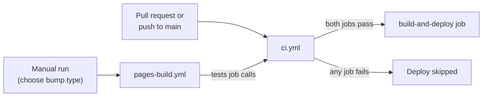
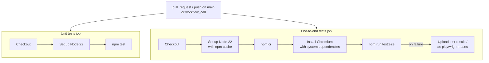
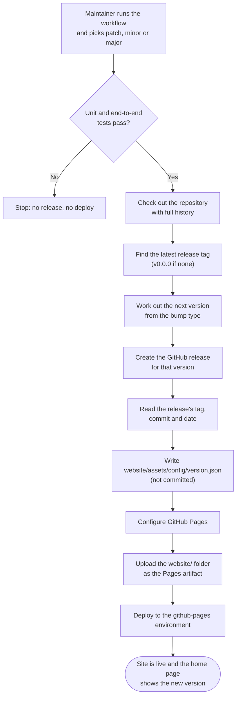

# 🚀 CI and Deployment

> **Written for:** Maintainers who review pull requests, trigger releases, or change the GitHub Actions workflows.

The repository has two workflows in `.github/workflows/`. `ci.yml` tests every change, and `pages-build.yml` releases and deploys the site to GitHub Pages by hand, only after the same tests pass.

| Workflow | File | Trigger | Purpose |
| --- | --- | --- | --- |
| CI | `ci.yml` | Pull request to `main`, push to `main`, or called by another workflow | Run the unit and end-to-end tests. |
| Build and deploy GitHub Pages | `pages-build.yml` | Manual (`workflow_dispatch`) | Test, bump the version, create a release, and publish `website/`. |

## 🔁 How the workflows fit together

`pages-build.yml` reuses `ci.yml` through `workflow_call`, so the tests are defined in one place.

## ✅ CI workflow

Two jobs run in parallel, and the workflow passes only when both pass.

| Job | Runs | Notes |
| --- | --- | --- |
| Unit tests | `npm test` | Includes the check that every `.json` file in the repo is valid. Needs no installed dependencies. |
| End-to-end tests | `npm run test:e2e` | Installs Chromium on the runner each run. Loads Bootstrap, pdf-lib and pdf.js from CDNs, so it needs network access. |

> [!TIP]
> When the end-to-end job fails, download the `playwright-traces` artifact from the run and open a trace with `npx playwright show-trace <trace.zip>`.

A red CI check blocks merging, so both jobs must pass before a pull request can merge.

## 📦 Deployment workflow

A maintainer starts it from the **Actions** tab with **Run workflow** and picks a bump type.

| Input | Values | Default |
| --- | --- | --- |
| `bump` | `patch`, `minor`, `major` | `patch` |

### 🗺️ From click to live site

### 🔢 Versioning

The next version comes from the newest published (non-draft, non-pre-release) GitHub release tag. With no release yet, it starts from `v0.0.0`.

| Bump | Example: from `v1.4.2` |
| --- | --- |
| `patch` | `v1.4.3` |
| `minor` | `v1.5.0` |
| `major` | `v2.0.0` |

The release is created against the commit the workflow runs on and titled `Release <version>`.

### 🧾 Version metadata

The workflow generates `website/assets/config/version.json` during the run. It is not committed. The home page reads it to show the repository link, version, commit and update date.

| Field | Source |
| --- | --- |
| `repoUrl` | The GitHub repository URL |
| `version` | The new release tag |
| `buildNumber` | The workflow run number |
| `commitHash` | First 6 characters of the release's target commit |
| `updatedDate` | The release's creation date, as `dd Mon yyyy` |
| `isoDate` | The release's creation timestamp |

### 🔒 Safeguards

- **Tests gate the release:** the `build-and-deploy` job needs the `tests` job, so a failing test stops the run before any release or deploy.
- **One deploy at a time:** the `pages` concurrency group queues deployments instead of cancelling a running one.
- **Scoped permissions:** the workflow requests `contents: write` (create the release), `pages: write` and `id-token: write` (deploy).
- **Only `website/` is published:** the Pages artifact is the `website/` folder.

> [!WARNING]
> The release is created before the deploy step. If the deploy fails after that point, the new release tag still exists. Re-run the workflow to publish, which creates the next version.

## 📚 Related docs

| Doc | Read it for |
| --- | --- |
| [TESTING.md](TESTING.md) | What the unit and end-to-end tests cover and how to run them locally. |
| [../CONTRIBUTING.md](../CONTRIBUTING.md) | The pull request checklist that CI enforces. |
